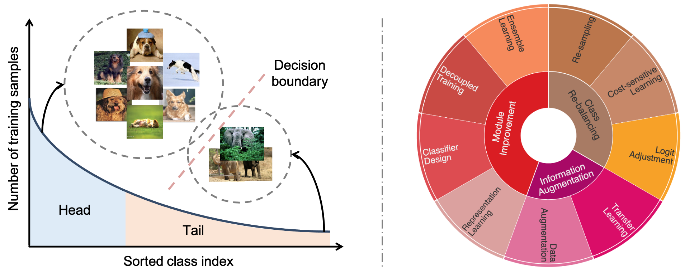
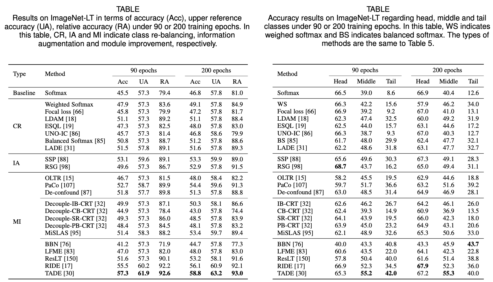
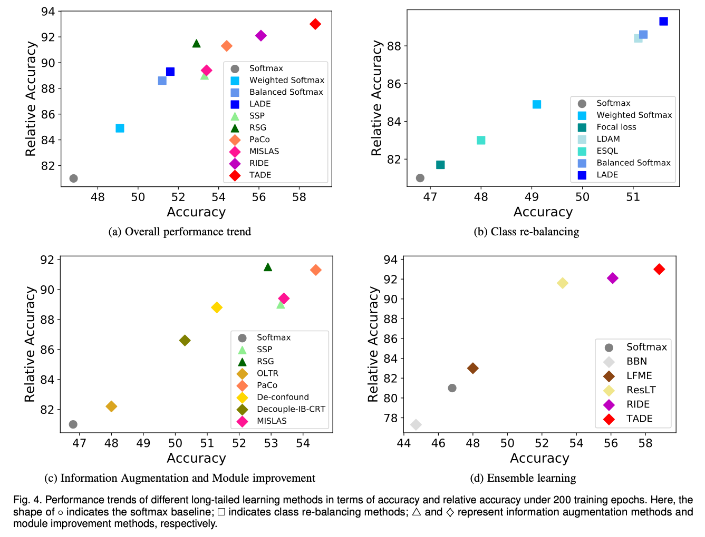
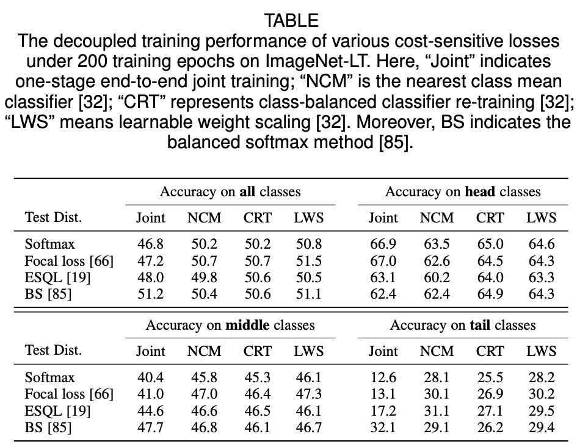

# Awesome Long-Tailed Learning 

A curated list of awesome deep long-tailed learning resources. We recently released *[Deep Long-Tailed Learning: A Survey](https://arxiv.org/pdf/2110.04596.pdf)* to the community. In this survey, we reviewed recent advances in long-tailed learning based on deep neural networks. 

Specifically, existing long-tailed learning studies can be grouped into three main categories (i.e., class re-balancing, information augmentation and module improvement), which can be further classified into nine sub-categories (as shown in the below figure). We also empirically analyzed several state-of-the-art methods by evaluating to what extent they address the issue of class imbalance. We concluded the survey by highlighting important applications of deep long-tailed learning and identifying several promising directions for future research. After completing this survey, we decided to release the collected long-tailed learning resources, hoping to push the development of the community. If you have any questions or suggestions, please feel free to contact us.

<p align="center">

</p>

## 1. Type of Long-tailed Learning

| Symbol    | `Sampling`          | `CSL`           | `LA`                   | `TL`                 | `Aug`                  | 
|:----------- |:-------------:|:--------------:|:----------------------: |:---------------------:|:----------------------:| 
| Type | Re-sampling | Cost-sensitive Learning | Logit Adjustment | Transfer Learning | Data Augmentation | 

| Symbol    | `RL`          | `CD`           | `DT`                   | `Ensemble`                 | `other`                  | 
|:----------- |:-------------:|:--------------:|:----------------------: |:---------------------:|:----------------------:| 
| Type | Representation Learning | Classifier Design | Decoupled Training | Ensemble Learning | Other Types | 

## 2. Top-tier Conference Papers

### 2021

| Title    | Venue    | Year | Type     | Code     | 
|:-------- |:--------:|:--------:|:--------:|:--------:|
[Improving contrastive learning on imbalanced seed data via open-world sampling](https://openreview.net/pdf?id=EIfV-XAggKo) | NeurIPS  | 2021 | `Sampling`,`TL`, `DC`     |    [Official](https://github.com/VITA-Group/MAK)   | 
[Semi-supervised semantic segmentation via adaptive equalization learning](https://papers.nips.cc/paper/2021/file/b98249b38337c5088bbc660d8f872d6a-Paper.pdf)  | NeurIPS  | 2021 |  `Sampling`,`CSL`,`TL`, `Aug`    |       [Official](https://github.com/hzhupku/SemiSeg-AEL)    | 
[On model calibration for long-tailed object detection and instance segmentation](https://proceedings.neurips.cc/paper/2021/file/14ad095ecc1c3e1b87f3c522836e9158-Paper.pdf) | NeurIPS  | 2021 |  `LA`   |    [Official](https://github.com/tydpan/NorCal)    | 
[Label-imbalanced and group-sensitive classification under overparameterization](https://openreview.net/pdf?id=UZm2IQhgIyB) | NeurIPS  | 2021 |  `LA`   |    
[Towards calibrated model for long-tailed visual recognition from prior perspective](https://papers.nips.cc/paper/2021/file/39ae2ed11b14a4ccb41d35e9d1ba5d11-Paper.pdf) |  NeurIPS  | 2021 |  `Aug`, `RL`   |   [Official](https://github.com/XuZhengzhuo/Prior-LT)
[Supercharging imbalanced data learning with energy-based contrastive representation transfer](https://papers.nips.cc/paper/2021/file/b151ce4935a3c2807e1dd9963eda16d8-Paper.pdf) | NeurIPS  | 2021 |  `Aug`, `TL`, `RL`   |  [Official](https://github.com/ZidiXiu/ECRT)
[VideoLT: Large-scale long-tailed video recognition](https://arxiv.org/pdf/2105.02668.pdf) | ICCV  | 2021 | `Sampling`     |    [Official](https://github.com/17Skye17/VideoLT)   | 
[Exploring classification equilibrium in long-tailed object detection](https://arxiv.org/pdf/2108.07507.pdf) | ICCV  | 2021 | `Sampling`,`CSL`     |     [Official](https://github.com/fcjian/LOCE)  |  
[GistNet: a geometric structure transfer network for long-tailed recognition](https://arxiv.org/pdf/2105.00131.pdf) | ICCV  | 2021 | `Sampling`,`TL`, `DC`      |       |  
[FASA: Feature augmentation and sampling adaptation for long-tailed instance segmentation](https://arxiv.org/pdf/2102.12867.pdf) | ICCV  | 2021 | `Sampling`,`CSL`     |       |  
[ACE: Ally complementary experts for solving long-tailed recognition in one-shot](https://arxiv.org/pdf/2108.02385.pdf) | ICCV  | 2021 | `Sampling`,`Ensemble`     |   [Official](https://github.com/jrcai/ACE?utm_source=catalyzex.com)     |  
[Influence-Balanced Loss for Imbalanced Visual Classification](https://arxiv.org/pdf/2110.02444.pdf) | ICCV  | 2021 | `CSL`     |   [Official](https://github.com/pseulki/IB-Loss)     |  
[Re-distributing biased pseudo labels for semi-supervised semantic segmentation: A baseline investigation](https://arxiv.org/pdf/2107.11279.pdf) | ICCV  | 2021 | `TL`     |    [Official](https://github.com/CVMI-Lab/DARS)   |  
[Self supervision to distillation for long-tailed visual recognition](https://arxiv.org/pdf/2109.04075.pdf) | ICCV  | 2021 | `TL`     |    [Official](https://github.com/MCG-NJU/SSD-LT)     |  
[Distilling virtual examples for long-tailed recognition](https://cs.nju.edu.cn/wujx/paper/ICCV2021_DiVE.pdf) | ICCV  | 2021 | `TL`     |       |  
[MosaicOS: A simple and effective use of object-centric images for long-tailed object detection](https://arxiv.org/pdf/2102.08884.pdf) | ICCV  | 2021 | `TL`     |   [Official](https://github.com/czhang0528/MosaicOS/)      |  
[Parametric contrastive learning](https://arxiv.org/pdf/2107.12028.pdf) | ICCV  | 2021 | `RL`     |     [Official](https://github.com/dvlab-research/Parametric-Contrastive-Learning)     |  
[Distributional robustness loss for long-tail learning](https://arxiv.org/pdf/2104.03066.pdf) | ICCV  | 2021 | `RL`     |     [Official](https://github.com/dvirsamuel/DRO-LT)      | 
[Learning of visual relations: The devil is in the tails](https://arxiv.org/pdf/2108.09668.pdf) | ICCV  | 2021 | `DT`     |       |  
[Delving into deep imbalanced regression](https://arxiv.org/pdf/2102.09554.pdf) | ICML  | 2021 | `Other`     |    [Official](https://github.com/YyzHarry/imbalanced-regression)   |  
[Long-tailed multi-label visual recognition by collaborative training on uniform and re-balanced samplings](https://openaccess.thecvf.com/content/CVPR2021/papers/Guo_Long-Tailed_Multi-Label_Visual_Recognition_by_Collaborative_Training_on_Uniform_and_CVPR_2021_paper.pdf) | CVPR  | 2021 | `Sampling`,`Ensemble` |       |
[Equalization loss v2: A new gradient balance approach for long-tailed object detection](https://openaccess.thecvf.com/content/CVPR2021/papers/Tan_Equalization_Loss_v2_A_New_Gradient_Balance_Approach_for_Long-Tailed_CVPR_2021_paper.pdf) | CVPR  | 2021 | `CSL`  |    [Official](https://github.com/tztztztztz/eqlv2)    | 
[Seesaw loss for long-tailed instance segmentation](https://openaccess.thecvf.com/content/CVPR2021/papers/Wang_Seesaw_Loss_for_Long-Tailed_Instance_Segmentation_CVPR_2021_paper.pdf) | CVPR  | 2021 | `CSL`  |    [Official](https://github.com/open-mmlab/mmdetection)   | 
[Adaptive class suppression loss for long-tail object detection](https://openaccess.thecvf.com/content/CVPR2021/papers/Wang_Adaptive_Class_Suppression_Loss_for_Long-Tail_Object_Detection_CVPR_2021_paper.pdf) | CVPR  | 2021 | `CSL`  |      [Official](https://github.com/CASIA-IVA-Lab/ACSL)      | 
[PML: Progressive margin loss for long-tailed age classification](https://openaccess.thecvf.com/content/CVPR2021/papers/Deng_PML_Progressive_Margin_Loss_for_Long-Tailed_Age_Classification_CVPR_2021_paper.pdf) | CVPR  | 2021 | `CSL`  |       | 
[Disentangling label distribution for long-tailed visual recognition](https://openaccess.thecvf.com/content/CVPR2021/papers/Hong_Disentangling_Label_Distribution_for_Long-Tailed_Visual_Recognition_CVPR_2021_paper.pdf) | CVPR  | 2021 | `CSL`,`LA`  |   [Official](https://github.com/hyperconnect/LADE)      | 
[Adversarial robustness under long-tailed distribution](https://openaccess.thecvf.com/content/CVPR2021/papers/Wu_Adversarial_Robustness_Under_Long-Tailed_Distribution_CVPR_2021_paper.pdf) | CVPR  | 2021 | `CSL`,`LA`,`CD`  |    [Official](https://github.com/wutong16/Adversarial_Long-Tail)     | 
[Distribution alignment: A unified framework for long-tail visual recognition](https://openaccess.thecvf.com/content/CVPR2021/papers/Zhang_Distribution_Alignment_A_Unified_Framework_for_Long-Tail_Visual_Recognition_CVPR_2021_paper.pdf) | CVPR  | 2021 | `CSL`,`LA`,`DT`  |    [Official](https://github.com/Megvii-BaseDetection/DisAlign)   | 
[Improving calibration for long-tailed recognition](https://openaccess.thecvf.com/content/CVPR2021/papers/Zhong_Improving_Calibration_for_Long-Tailed_Recognition_CVPR_2021_paper.pdf) | CVPR  | 2021 | `CSL`,`Aug`,`DT`  |      [Official](https://github.com/dvlab-research/MiSLAS) | 
[CReST: A classrebalancing self-training framework for imbalanced semi-supervised learning](https://openaccess.thecvf.com/content/CVPR2021/papers/Wei_CReST_A_Class-Rebalancing_Self-Training_Framework_for_Imbalanced_Semi-Supervised_Learning_CVPR_2021_paper.pdf) | CVPR  | 2021 | `TL`  |  [Official](https://github.com/google-research/crest)        | 
[Conceptual 12M: Pushing web-scale image-text pre-training to recognize long-tail visual concepts](https://openaccess.thecvf.com/content/CVPR2021/papers/Changpinyo_Conceptual_12M_Pushing_Web-Scale_Image-Text_Pre-Training_To_Recognize_Long-Tail_Visual_CVPR_2021_paper.pdf) | CVPR  | 2021 | `TL`  |    [Official](https://github.com/google-research-datasets/conceptual-12m)     | 
[RSG: A simple but effective module for learning imbalanced datasets](https://openaccess.thecvf.com/content/CVPR2021/supplemental/Wang_RSG_A_Simple_CVPR_2021_supplemental.pdf) | CVPR  | 2021 | `TL`,`Aug`  |    [Official](https://github.com/Jianf-Wang/RSG)   |
[MetaSAug: Meta semantic augmentation for long-tailed visual recognition](https://openaccess.thecvf.com/content/CVPR2021/papers/Li_MetaSAug_Meta_Semantic_Augmentation_for_Long-Tailed_Visual_Recognition_CVPR_2021_paper.pdf) | CVPR  | 2021 | `Aug`  |      [Official](https://github.com/BIT-DA/MetaSAug)    |
[Contrastive learning based hybrid networks for long-tailed image classification](https://openaccess.thecvf.com/content/CVPR2021/papers/Wang_Contrastive_Learning_Based_Hybrid_Networks_for_Long-Tailed_Image_Classification_CVPR_2021_paper.pdf) | CVPR  | 2021 | `RL`  |       |  
[Unsupervised discovery of the long-tail in instance segmentation using hierarchical self-supervision](https://openaccess.thecvf.com/content/CVPR2021/papers/Weng_Unsupervised_Discovery_of_the_Long-Tail_in_Instance_Segmentation_Using_Hierarchical_CVPR_2021_paper.pdf) | CVPR  | 2021 | `RL`  |       |  
[Long-tail learning via logit adjustment](https://openreview.net/pdf?id=37nvvqkCo5) | ICLR  | 2021 | `LA`     | [Official](https://github.com/google-research/google-research/tree/master/logit_adjustment)    | 
[Long-tailed recognition by routing diverse distribution-aware experts](https://openreview.net/pdf?id=D9I3drBz4UC) | ICLR  | 2021 | `TL`,`Ensemble`  |  [Official](https://github.com/frank-xwang/RIDE-LongTailRecognition)      |  
[Exploring balanced feature spaces for representation learning](https://openreview.net/pdf?id=OqtLIabPTit) | ICLR  | 2021 | `RL`,`DT`  |       |  

### 2020
 
| Title    | Venue    | Year | Type     | Code     | 
|:-------- |:--------:|:--------:|:--------:|:--------:|
[Balanced meta-softmax for long-taield visual recognition](https://proceedings.neurips.cc/paper/2020/file/2ba61cc3a8f44143e1f2f13b2b729ab3-Paper.pdf) | NeurIPS  | 2020 | `Sampling`,`CSL`     |       [Official](https://github.com/jiawei-ren/BalancedMetaSoftmax)   | 
[Posterior recalibration for imbalanced datasets](https://proceedings.neurips.cc/paper/2020/file/5ca359ab1e9e3b9c478459944a2d9ca5-Paper.pdf) | NeurIPS  | 2020 | `LA`     |   [Official](https://github.com/GT-RIPL/UNO-IC)    | 
[Long-tailed classification by keeping the good and removing the bad momentum causal effect](https://proceedings.neurips.cc/paper/2020/file/1091660f3dff84fd648efe31391c5524-Paper.pdf) | NeurIPS  | 2020 | `LA`,`CD`     |     [Official](https://github.com/KaihuaTang/Long-Tailed-Recognition.pytorch)  | 
[Rethinking the value of labels for improving classimbalanced learning](https://proceedings.neurips.cc/paper/2020/file/e025b6279c1b88d3ec0eca6fcb6e6280-Paper.pdf) | NeurIPS  | 2020 | `TL`,`RA`     |   [Official](https://github.com/YyzHarry/imbalanced-semi-self)    | 
[The devil is in classification: A simple framework for long-tail instance segmentation](https://www.ecva.net/papers/eccv_2020/papers_ECCV/papers/123590715.pdf) | ECCV  | 2020 | `Sampling`,`DT`,`Ensemble`     |    [Official](https://github.com/twangnh/SimCal)   |
[Imbalanced continual learning with partitioning reservoir sampling](https://www.ecva.net/papers/eccv_2020/papers_ECCV/papers/123580409.pdf) | ECCV  | 2020 | `Sampling`      |    [Official](https://github.com/cdjkim/PRS)   |
[Distribution-balanced loss for multi-label classification in long-tailed datasets](https://www.ecva.net/papers/eccv_2020/papers_ECCV/papers/123490154.pdf) | ECCV  | 2020 | `CSL`     |    [Official](https://github.com/wutong16/DistributionBalancedLoss)      |
[Feature space augmentation for long-tailed data](https://www.ecva.net/papers/eccv_2020/papers_ECCV/papers/123740681.pdf) | ECCV  | 2020 | `TL`,`Aug`,`DT`     |       |
[Learning from multiple experts: Self-paced knowledge distillation for long-tailed classification](https://www.ecva.net/papers/eccv_2020/papers_ECCV/papers/123500239.pdf) | ECCV  | 2020 | `TL`,`Ensemble`     |  [Official](https://github.com/xiangly55/LFME)      |
[Solving long-tailed recognition with deep realistic taxonomic classifier](https://www.ecva.net/papers/eccv_2020/papers_ECCV/papers/123530171.pdf) | ECCV  | 2020 | `CD`     |  [Official](https://github.com/gina9726/Deep-RTC)     |
[Learning to segment the tail](https://openaccess.thecvf.com/content_CVPR_2020/papers/Hu_Learning_to_Segment_the_Tail_CVPR_2020_paper.pdf) | CVPR  | 2020 | `Sampling`,`TL`     |   [Official](https://github.com/JoyHuYY1412/LST_LVIS)    |
[BBN: Bilateral-branch network with cumulative learning for long-tailed visual recognition](https://openaccess.thecvf.com/content_CVPR_2020/papers/Zhou_BBN_Bilateral-Branch_Network_With_Cumulative_Learning_for_Long-Tailed_Visual_Recognition_CVPR_2020_paper.pdf) | CVPR  | 2020 | `Sampling`,`Ensemble`     |    [Official](https://github.com/Megvii-Nanjing/BBN)    |
[Overcoming classifier imbalance for long-tail object detection with balanced group softmax](https://openaccess.thecvf.com/content_CVPR_2020/papers/Li_Overcoming_Classifier_Imbalance_for_Long-Tail_Object_Detection_With_Balanced_Group_CVPR_2020_paper.pdf) | CVPR  | 2020 | `Sampling`,`Ensemble`     |   [Official](https://github.com/FishYuLi/BalancedGroupSoftmax)     |
[Rethinking class-balanced methods for long-tailed visual recognition from a domain adaptation perspective](https://openaccess.thecvf.com/content_CVPR_2020/papers/Jamal_Rethinking_Class-Balanced_Methods_for_Long-Tailed_Visual_Recognition_From_a_Domain_CVPR_2020_paper.pdf) | CVPR  | 2020 | `CSL`     |  [Official](https://github.com/abdullahjamal/Longtail_DA)      |
[Equalization loss for long-tailed object recognition](https://openaccess.thecvf.com/content_CVPR_2020/papers/Tan_Equalization_Loss_for_Long-Tailed_Object_Recognition_CVPR_2020_paper.pdf) | CVPR  | 2020 | `CSL`     |    [Official](https://github.com/tztztztztz/eqlv2)       |
[Domain balancing: Face recognition on long-tailed domains](https://openaccess.thecvf.com/content_CVPR_2020/papers/Cao_Domain_Balancing_Face_Recognition_on_Long-Tailed_Domains_CVPR_2020_paper.pdf) | CVPR  | 2020 | `CSL`     |       |
[M2m: Imbalanced classification via majorto-minor translation](https://openaccess.thecvf.com/content_CVPR_2020/papers/Kim_M2m_Imbalanced_Classification_via_Major-to-Minor_Translation_CVPR_2020_paper.pdf) | CVPR  | 2020 | `TL`,`Aug`     |    [Official](https://github.com/alinlab/M2m)        |
[Deep representation learning on long-tailed data: A learnable embedding augmentation perspective](https://openaccess.thecvf.com/content_CVPR_2020/papers/Liu_Deep_Representation_Learning_on_Long-Tailed_Data_A_Learnable_Embedding_Augmentation_CVPR_2020_paper.pdf) | CVPR  | 2020 | `TL`,`Aug`,`RL`     |       |
[Inflated episodic memory with region self-attention for long-tailed visual recognition](https://openaccess.thecvf.com/content_CVPR_2020/papers/Zhu_Inflated_Episodic_Memory_With_Region_Self-Attention_for_Long-Tailed_Visual_Recognition_CVPR_2020_paper.pdf) | CVPR  | 2020 | `RL`     |       |
[Decoupling representation and classifier for long-tailed recognition](https://openreview.net/pdf?id=r1gRTCVFvB) | ICLR  | 2020 | `Sampling`,`CSL`,`RL`,`CD`,`DT`     |    [Official](https://github.com/facebookresearch/classifier-balancing)      |


### 2019

| Title    | Venue    | Year | Type     | Code     | 
|:-------- |:--------:|:--------:|:--------:|:--------:|
[Meta-weight-net: Learning an explicit mapping for sample weighting](https://proceedings.neurips.cc/paper/2019/file/e58cc5ca94270acaceed13bc82dfedf7-Paper.pdf) | NeurIPS  | 2019 | `CSL`     |   [Official](https://github.com/xjtushujun/meta-weight-net)       | 
[Learning imbalanced datasets with label-distribution-aware margin loss](https://proceedings.neurips.cc/paper/2019/file/621461af90cadfdaf0e8d4cc25129f91-Paper.pdf) | NeurIPS  | 2019 | `CSL`     |    [Official](https://github.com/kaidic/LDAM-DRW)       | 
[Dynamic curriculum learning for imbalanced data classification](https://openaccess.thecvf.com/content_ICCV_2019/papers/Wang_Dynamic_Curriculum_Learning_for_Imbalanced_Data_Classification_ICCV_2019_paper.pdf) | ICCV  | 2019 | `Sampling`     |       |
[Class-balanced loss based on effective number of samples](https://openaccess.thecvf.com/content_CVPR_2019/papers/Cui_Class-Balanced_Loss_Based_on_Effective_Number_of_Samples_CVPR_2019_paper.pdf) | CVPR  | 2019 | `CSL`     |   [Official](https://github.com/richardaecn/class-balanced-loss)    |
[Striking the right balance with uncertainty](https://openaccess.thecvf.com/content_CVPR_2019/papers/Khan_Striking_the_Right_Balance_With_Uncertainty_CVPR_2019_paper.pdf) | CVPR  | 2019 | `CSL`     |       |
[Feature transfer learning for face recognition with under-represented data](https://openaccess.thecvf.com/content_CVPR_2019/papers/Yin_Feature_Transfer_Learning_for_Face_Recognition_With_Under-Represented_Data_CVPR_2019_paper.pdf) | CVPR  | 2019 | `TL`,`Aug`     |       |
[Unequal-training for deep face recognition with long-tailed noisy data](https://openaccess.thecvf.com/content_CVPR_2019/papers/Zhong_Unequal-Training_for_Deep_Face_Recognition_With_Long-Tailed_Noisy_Data_CVPR_2019_paper.pdf) | CVPR  | 2019 | `RL`     |  [Official](https://github.com/zhongyy/Unequal-Training-for-Deep-Face-Recognition-with-Long-Tailed-Noisy-Data)      |
[Large-scale long-tailed recognition in an open world](https://openaccess.thecvf.com/content_CVPR_2019/papers/Liu_Large-Scale_Long-Tailed_Recognition_in_an_Open_World_CVPR_2019_paper.pdf) | CVPR  | 2019 | `RL`     |   [Official](https://github.com/zhmiao/OpenLongTailRecognition-OLTR)     |

### 2018

| Title    | Venue    | Year | Type     | Code     | 
|:-------- |:--------:|:--------:|:--------:|:--------:|
[Large scale fine-grained categorization and domain-specific transfer learning](https://openaccess.thecvf.com/content_cvpr_2018/papers/Cui_Large_Scale_Fine-Grained_CVPR_2018_paper.pdf) | CVPR  | 2018 | `TL`     |   [Official](https://github.com/richardaecn/cvpr18-inaturalist-transfer)      | 

### 2017

| Title    | Venue    | Year | Type     | Code     | 
|:-------- |:--------:|:--------:|:--------:|:--------:|
[Learning to model the tail](https://proceedings.neurips.cc/paper/2017/file/147ebe637038ca50a1265abac8dea181-Paper.pdf) | NeurIPS  | 2017 | `CSL`     |       | 
[Focal loss for dense object detection](https://openaccess.thecvf.com/content_ICCV_2017/papers/Lin_Focal_Loss_for_ICCV_2017_paper.pdf) | ICCV  | 2017 | `CSL`     |       | 
[Range loss for deep face recognition with long-tailed training data](https://openaccess.thecvf.com/content_ICCV_2017/papers/Zhang_Range_Loss_for_ICCV_2017_paper.pdf) | ICCV  | 2017 | `RL`     |       | 
[Class rectification hard mining for imbalanced deep learning](https://openaccess.thecvf.com/content_ICCV_2017/papers/Dong_Class_Rectification_Hard_ICCV_2017_paper.pdf) | ICCV  | 2017 | `RL`     |       | 

### 2016

| Title    | Venue    | Year | Type     | Code     | 
|:-------- |:--------:|:--------:|:--------:|:--------:|
[Learning deep representation for imbalanced classification](https://openaccess.thecvf.com/content_cvpr_2016/papers/Huang_Learning_Deep_Representation_CVPR_2016_paper.pdf) | CVPR  | 2016 | `Sampling`,`RL`     |       | 
[Factors in finetuning deep model for object detection with long-tail distribution](https://openaccess.thecvf.com/content_cvpr_2016/papers/Ouyang_Factors_in_Finetuning_CVPR_2016_paper.pdf) | CVPR  | 2016 | `CSL`,`RL`     |       | 

## 3. Benchmark Datasets
| Dataset    | Long-tailed Task    | # Class | # Training data      | # Test data       | 
|:-------- |:--------:|:--------:|:--------:|:--------:|
| ImageNet-LT   |  Classification     | 1,000 | 115,846      | 50,000       | 
| CIFAR100-LT   |   Classification     | 100 | 50,000      | 10,000       | 
| Places-LT   |   Classification     | 365 | 62,500      | 36,500       | 
| iNaturalist 2018   |   Classification     | 8,142 | 437,513     | 24,426       | 
| LVIS v0.5   | Detection and Segmentation     | 1,230 | 57,000     | 20,000      | 
| LVIS v1   | Detection and Segmentation     | 1,203 | 100,000     | 19,800      | 
|  VOC-LT   | Multi-label Classification     | 20 | 1,142     |  4,952      | 
|  COCO-LT   | Multi-label Classification     | 80 | 1,909     |  5,000      | 
|  VideoLT   | Video Classification     | 1,004 | 179,352     |  25,622      | 

## 4. Empirical Studies

### (1) Long-tailed benchmarking performance

* We evaluate several state-of-the-art methods on ImageNet-LT to see to what extent they handle class imbalance via new evaluation metrics, i.e., UA (upper bound accuracy) and RA (relative accuracy). We categorize these methods based on class re-balancing (CR), information augmentation (IA) and module improvement (MI). 

<p align="center">

</p>

* Almost all long-tailed methods perform better than the Softmax baseline in terms of accuracy, which demonstrates the effectiveness of long-tailed learning. 
* Training with 200 epochs   leads to better performance for most long-tailed methods, since sufficient  training enables deep models to fit data better and learn better image representations.
* In addition to accuracy, we also evaluate long-tailed  methods based on UA and RA. For the methods that have higher  UA, the performance gain  comes  not only  from the alleviation of class imbalance, but also from other factors, like data augmentation or better network architectures. Therefore, simply using accuracy for evaluation is not accurate enough, while  our proposed RA metric provides a good complement, since it alleviates the influences of factors apart from class imbalance. 
* For example, MiSLAS, based on data mixup, has higher accuracy than Balanced Sofmtax under 90 training epochs, but it also has higher UA. As a result, the relative accuracy of  MiSLAS is lower than Balanced Sofmtax, which means that Balanced Sofmtax alleviates class imbalance better than MiSLAS under 90 training epochs.
* Although some recent high-accuracy methods   have  lower RA, the overall development trend of long-tailed learning is still positive, as shown in the below figure.


 


<p align="center">

</p>

* The current state-of-the-art long-tailed   method in terms of both accuracy and RA is TADE (ensemble-based method). 

### (2) More discussions on cost-sensitive losses

* We further evaluate the performance of different cost-sensitive learning losses based on the decoupled training scheme.
* Decoupled training, compared to joint training, can further improve  the   overall performance  of most cost-sensitive learning methods apart from balanced softmax (BS).
* Although BS outperofmrs other cost-sensitive losses under one-stage training, they perform comparably under decoupled training. This implies that although these cost-sensitive losses perform differently under joint training, they essentially learn similar  quality of feature representations. 

<p align="center">

</p>


## 5. Citation

If this repository is helpful to you, please cite our survey.

```
@article{zhang2021deep,
    title={Deep Long-Tailed Learning: A Survey},
    author={Zhang, Yifan and Kang, Bingyi and Hooi, Bryan and Yan, Shuicheng and Feng, Jiashi},
    journal={arXiv},
    year={2021}
}
```

## 5. Other Resources

- [Papers With Code: Long-tailed Learning](https://paperswithcode.com/task/long-tail-learning)
- [zzw-zwzhang/Awesome-of-Long-Tailed-Recognition](https://github.com/zzw-zwzhang/Awesome-of-Long-Tailed-Recognition)
- [TADE/Test-Agnostic Long-Tailed Recognition](https://github.com/Vanint/TADE-AgnosticLT)
