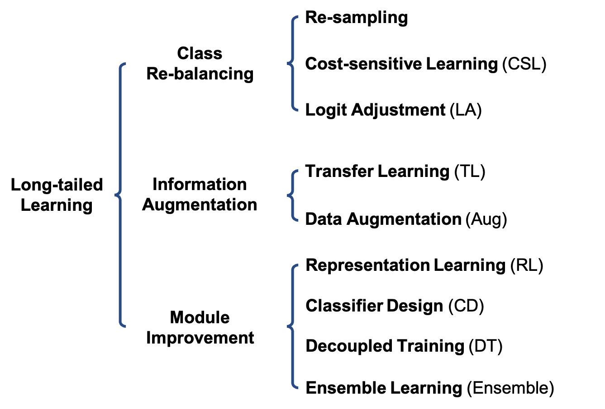

# Awesome Long-Tailed Learning 

A curated list of awesome deep long-tailed learning resources.

Recently, we released *[Deep Long-Tailed Learning: A Survey]()* to the community. In this survey, we reviewed recent advances of long-tailed learning based on deep neural networks. To be specific, existing deep long-tailed learning studies can be grouped into three main categories (i.e., class re-balancing, information augmentation and module improvement), which can be further classified into nine sub-categories (as shown in below figure). We also empirically analyzeed several state-of-the-art methods by evaluating to what extent they address the issue of class imbalance. We concluded the survey by highlighting important applications of deep long-tailed learning and identifying several promising directions for future research. After completing this survey, we decided to release the collected long-tailed learning resources, hoping to push the development of the community. We will keep updating our survey and this repository. If you have any questions or suggestions, please feel free to contact us.

<p align="center">

</p>

## Type of Long-tailed Learning

| Symbol    | `Sampling`          | `CSL`           | `LA`                   | `TL`                 | `Aug`                  | 
|:----------- |:-------------:|:--------------:|:----------------------: |:---------------------:|:----------------------:| 
| Type | Re-Sampling | Cost-sensitive Learning | Logit Adjustment | Transfer Learning | Data Augmentation | 

| Symbol    | `RL`          | `CD`           | `DT`                   | `Ensemble`                 | `other`                  | 
|:----------- |:-------------:|:--------------:|:----------------------: |:---------------------:|:----------------------:| 
| Type | Representation Learning | Classifier Design | Decoupled Training | Ensemble Learning | Other Types | 

## Papers

### 2021

| Title    | Venue    | Year | Type     | Code     | 
|:-------- |:--------:|:--------:|:--------:|:--------:|
[Video-LT]() | ICCV  | 2021 | `Sampling`     |       | 
[LOCE]() | ICCV  | 2021 | `Sampling`,`CSL`     |       |  
[GIST]() | ICCV  | 2021 | `Sampling`,`TL`, `DC`      |       |  
[FASA]() | ICCV  | 2021 | `Sampling`,`CSL`     |       |  
[ACE]() | ICCV  | 2021 | `Sampling`,`Ensemble`     |       |  
[DARS]() | ICCV  | 2021 | `TL`     |       |  
[SSD]() | ICCV  | 2021 | `TL`     |       |  
[DiVE]() | ICCV  | 2021 | `TL`     |       |  
[MosaicOS]() | ICCV  | 2021 | `TL`     |       |  
[PaCo]() | ICCV  | 2021 | `RL`     |       |  
[DRO-LT]() | ICCV  | 2021 | `RL`     |       | 
[DT2]() | ICCV  | 2021 | `DT`     |       |  
[Delving into Deep Imbalanced Regression](https://arxiv.org/pdf/2102.09554.pdf) | ICML  | 2021 | `Other`     |    [Official](https://github.com/YyzHarry/imbalanced-regression)   |  
[LTML]() | CVPR  | 2021 | `Sampling`,`Ensemble` |       |
[Equalization loss v2]() | CVPR  | 2021 | `CSL`  |       | 
[Seesaw loss]() | CVPR  | 2021 | `CSL`  |       | 
[ACSL]() | CVPR  | 2021 | `CSL`  |       | 
[PML]() | CVPR  | 2021 | `CSL`  |       | 
[LADE]() | CVPR  | 2021 | `CSL`,`LA`  |       | 
[RoBal]() | CVPR  | 2021 | `CSL`,`LA`,`CD`  |       | 
[DisAlign]() | CVPR  | 2021 | `CSL`,`LA`,`DT`  |       | 
[MiSLAS]() | CVPR  | 2021 | `CSL`,`Aug`,`DT`  |       | 
[CReST]() | CVPR  | 2021 | `TL`  |       | 
[Conceptual 12M]() | CVPR  | 2021 | `TL`  |       | 
[RSG]() | CVPR  | 2021 | `TL`,`Aug`  |       |
[MetaSAug]() | CVPR  | 2021 | `Aug`  |       |
[Hybrid]() | CVPR  | 2021 | `RL`  |       |  
[Unsupervised discovery]() | CVPR  | 2021 | `RL`  |       |  
[Long-Tail Learning via Logit Adjustment](https://openreview.net/pdf?id=37nvvqkCo5) | ICLR  | 2021 | `LA`     | Official    | 
[RIDE]() | ICLR  | 2021 | `TL`,`Ensemble`  |       |  
[KCL]() | ICLR  | 2021 | `RL`,`DT`  |       |  

### 2020

| Title    | Venue    | Year | Type     | Code     | 
|:-------- |:--------:|:--------:|:--------:|:--------:|
[Balanced Meta-Softmax]() | NeurIPS  | 2020 | `Sampling`,`CSL`     |       | 
[UNO-IC]() | NeurIPS  | 2020 | `LA`     |       | 
[De-confound-TDE]() | NeurIPS  | 2020 | `LA`,`CD`     |       | 
[SSP]() | NeurIPS  | 2020 | `TL`,`RA`     |       | 
[SimCal]() | ECCV  | 2020 | `Sampling`,`DT`,`Ensemble`     |       |
[PRS]() | ECCV  | 2020 | `Sampling`      |       |
[Distribution-balanced loss]() | ECCV  | 2020 | `CSL`     |       |
[OFA]() | ECCV  | 2020 | `TL`,`Aug`,`DT`     |       |
[LFME]() | ECCV  | 2020 | `TL`,`Ensemble`     |       |
[Deep-RTC]() | ECCV  | 2020 | `CD`     |       |
[LST]() | CVPR  | 2020 | `Sampling`,`TL`     |       |
[BBN]() | CVPR  | 2020 | `Sampling`,`Ensemble`     |       |
[BAGS]() | CVPR  | 2020 | `Sampling`,`Ensemble`     |       |
[Domain adaptation]() | CVPR  | 2020 | `CSL`     |       |
[Equalization loss]() | CVPR  | 2020 | `CSL`     |       |
[DBM]() | CVPR  | 2020 | `CSL`     |       |
[M2m]() | CVPR  | 2020 | `TL`,`Aug`     |       |
[LEAP]() | CVPR  | 2020 | `TL`,`Aug`,`RL`     |       |
[IEM]() | CVPR  | 2020 | `RL`     |       |
[Decoupling]() | ICLR  | 2020 | `Sampling`,`CSL`,`RL`,`CD`,`DT`     |       |


### 2019

| Title    | Venue    | Year | Type     | Code     | 
|:-------- |:--------:|:--------:|:--------:|:--------:|
[Meta-Weight-Net]() | NeurIPS  | 2019 | `CSL`     |       | 
[LDAM]() | NeurIPS  | 2019 | `CSL`     |       | 
[DCL]() | ICCV  | 2019 | `Sampling`     |       |
[CB]() | CVPR  | 2019 | `CSL`     |       |
[Bayesian estimate]() | CVPR  | 2019 | `CSL`     |       |
[FTL]() | CVPR  | 2019 | `TL`,`Aug`     |       |
[Unequal-training]() | CVPR  | 2019 | `RL`     |       |
[OLTR]() | CVPR  | 2019 | `RL`     |       |

### 2018

| Title    | Venue    | Year | Type     | Code     | 
|:-------- |:--------:|:--------:|:--------:|:--------:|
[DSTL]() | CVPR  | 2018 | `TL`     |       | 

### 2017

| Title    | Venue    | Year | Type     | Code     | 
|:-------- |:--------:|:--------:|:--------:|:--------:|
[MetaModelNet]() | NeurIPS  | 2017 | `CSL`     |       | 
[Focal loss]() | ICCV  | 2017 | `CSL`     |       | 
[Range loss]() | ICCV  | 2017 | `RL`     |       | 
[CRL]() | ICCV  | 2017 | `RL`     |       | 

### 2016

| Title    | Venue    | Year | Type     | Code     | 
|:-------- |:--------:|:--------:|:--------:|:--------:|
[LMLE]() | CVPR  | 2016 | `Sampling`,`RL`     |       | 
[HFL]() | CVPR  | 2016 | `CSL`,`RL`     |       | 

## Citing this work 

If this repository is helpful to you, please cite our survey.

```
@article{zhang2021deep,
    title={Deep Long-Tailed Learning: A Survey},
    author={Zhang, Yifan and Kang, Bingyi and Hooi, Bryan and Yan, Shuicheng and Feng, Jiashi},
    journal={arXiv preprint},
    year={2021}
}
```
